 

 

  

<table>
  <tr>
    <td align="center"></td>
    <td align="center"></td>
    <td align="center"></td>
    <td align="center"></td>
  </tr>
</table>

---

## 👋 About me

I'm an **AI Product Manager and techno-functional Business Analyst** based in **Bangalore**, with **14+ years** across product, business analysis and technology delivery. I work where **Agentic AI meets regulated banking**. I turn complex business needs into **governed AI products**: clear requirements, human-in-the-loop controls, deterministic fallbacks and measurable outcomes.

- 🏦 **Now:** Product Manager at **Commonwealth Bank of Australia**, working across Agentic AI, Australian mortgage origination, construction lending and Murex Front Office
- 🤖 **Building in public:** a new AI agent for banking, PM and BA use cases in [**ai-agent-lab**](https://github.com/Neeraj-Mh/ai-agent-lab), built with Gemini and Claude
- 📈 **Domain depth:** DCM/ECM, syndicated loans, FX, IRS, fixed income, CCR, XVA/CVA, and algorithmic execution (TWAP, VWAP, POV, SOR)
- 🎓 **CBAP** (IIBA) · **MBA in Fintech**, BITS Pilani · **B.Tech in ECE**
- 💬 **Ask me about:** agent guardrails and evaluation, construction-loan automation, Murex STP, or writing BRDs that engineers actually love

---

## 🎯 What I focus on

<table>
  <tr>
    <td width="33%" valign="top">
      <h3>🤖 Agentic AI in banking</h3>
      Multi-agent, multi-modal workflows with tool calling, source verification, human-in-the-loop checkpoints, guardrails and evaluation metrics, designed for credit-risk and responsible-lending compliance.
    </td>
    <td width="33%" valign="top">
      <h3>🏛️ Capital markets & Murex</h3>
      Murex FO (Deal Capture, E-trade Pad, Static Data, MLC, GOM), front-to-back STP, CCR, XVA/CVA and PFE, plus clearing, collateral, SWIFT and settlement interfaces.
    </td>
    <td width="33%" valign="top">
      <h3>🧭 Product & delivery</h3>
      Discovery, roadmaps and backlog management. BRDs/FSDs, epics, user stories, acceptance criteria and RTMs. Trader UAT, defect triage and release sign-off in Agile/Scrum teams.
    </td>
  </tr>
</table>

---

## 💼 Experience

| Period | Role | Highlights |
|---|---|---|
| **2023 – now** | **Product Manager**, Agentic AI, Mortgages & Capital Markets Commonwealth Bank of Australia · Bangalore | Led **multi-modal agents** that reconcile builder invoices and stage claims against contracts. Designed **multi-agent progressive-drawdown validation** across loan systems, QS reports, builder licences and title records. Owns the **home-buying journey** (borrowing power, valuations, Home Guarantee Schemes) and **Murex FO STP** across FX, IRS, fixed income and money markets. |
| **2017 – 2023** | **Senior Business Analyst**, Investment Banking & Algo Trading HCL Technologies · Noida / Bangalore | Specified **TWAP, VWAP, POV, Implementation Shortfall and pairs-trading** strategies, plus backtesting and **smart order routing**. Mapped low-latency **OMS/EMS** integration with pre-trade risk controls. Wrote Murex FO, collateral, margin, PFE and CCP requirements. |
| **2016 – 2017** | **Senior Test Automation Engineer**, Trading Systems Cigniti Technologies · Hyderabad | Automated testing of algorithmic order execution, feed handlers, drop-copy and latency benchmarks |
| **2015 – 2016** | **Automation Engineer** Coforge · Greater Noida | Selenium regression frameworks across web, UI and API flows |
| **2011 – 2014** | **Software Engineer** Wipro Technologies · Bangalore | Enterprise web application development and releases |

---

## 🚀 Featured work

<table>
  <tr>
    <td width="50%" valign="top">
      <h3>🧪 <a href="https://github.com/Neeraj-Mh/ai-agent-lab">AI Agent Lab</a></h3>
      A growing collection of AI agents for <b>banking, PM and BA</b> use cases, with one folder per agent and a new one shipped regularly.  
      <b>Flagship: <a href="https://github.com/Neeraj-Mh/ai-agent-lab/tree/main/VC%20due%20diligence%20team">VC Due Diligence Agent Team</a></b>. Nine agents turn a startup name or URL into live research, Bear/Base/Bull revenue models, a 5-category risk scorecard, an investment memo, an HTML report, an infographic and a <b>4-page BCG/McKinsey-style executive PDF</b>.  
      
      
      
      
    </td>
    <td width="50%" valign="top">
      <h3>⚖️ <a href="https://github.com/Neeraj-Mh/Trade_settlement_exception_resolver_agent">T+1 Settlement Exception Resolver</a></h3>
      Helps operations teams fix settlement failures caused by outdated or unregistered <b>SSIs</b>. It finds instructions in communications, extracts the proposed routing, shows the evidence with a confidence score, and prepares a <b>controlled amendment for human approval</b>.  
      
      
      
    </td>
  </tr>
  <tr>
    <td width="50%" valign="top">
      <h3>🧑‍💼 <a href="https://github.com/Neeraj-Mh/Ai_Recruiter_Agent">Multi-Agent AI Recruitment System</a></h3>
      An end-to-end hiring pipeline. It parses PDF résumés, gives each candidate an <b>LLM match score (0–100)</b> against the role, sends interview invites with Zoom links to qualified applicants, and gives everyone else <b>constructive feedback instead of silence</b>.  
      
      
      
    </td>
    <td width="50%" valign="top">
      <h3>📚 <a href="https://neeraj-mh.github.io/Portfolio/">Capital Markets BRD Library</a></h3>
      Business requirements documents from real-world-style initiatives: 
      • Murex <b>XVA (CVA & FVA)</b> pricing, provisioning and risk framework 
      • Real-time and end-of-day <b>XVA integration</b> platform 
      • Murex ↔ <b>MarkitWire</b> trade affirmation, STP and CCP routing 
      • <b>One Stop Processing</b> for centralised exception handling  
      
      
    </td>
  </tr>
</table>

---

## 🧰 Toolkit

**AI & agents** 

**Banking & capital markets** 

**Tools & tech** 
 

---

## 🏅 Credentials

<table>
  <tr>
    <td align="center" width="33%"><h3>🎖️ CBAP</h3>Certified Business Analysis Professional IIBA</td>
    <td align="center" width="33%"><h3>🎓 MBA, Fintech</h3>BITS Pilani CGPA 8.1 / 10</td>
    <td align="center" width="33%"><h3>⚙️ B.Tech, ECE</h3>Electronics & Communication Engineering IIET University</td>
  </tr>
</table>

---

## 📊 GitHub activity

---

## 🤝 Let's connect

I'm always happy to talk about **Agentic AI in financial services**, **AI product governance**, and **capital-markets transformation**.

 

  

<i>Governed AI, practical automation and measurable delivery for banking.</i>

